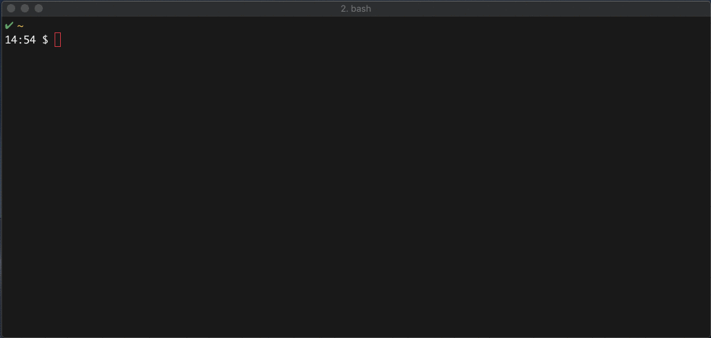

Run an IRCd server on PCF 

```console
  $ cf push ircd --docker-image inspircd/inspircd-docker -d tcp.apps.pcfone.io --random-route
```

To use IRC, you'll need an irc client
```console
  $ brew install irssi
```

Retrieve connection details (hostname/port) and connect to your IRC server:

```console
  $ cf apps | grep ircd
    ircd            started           1/1         1G       1G     tcp.apps.pcfone.io:10039
  $ irssi -c tcp.apps.pcfone.io -p 10039 
```



