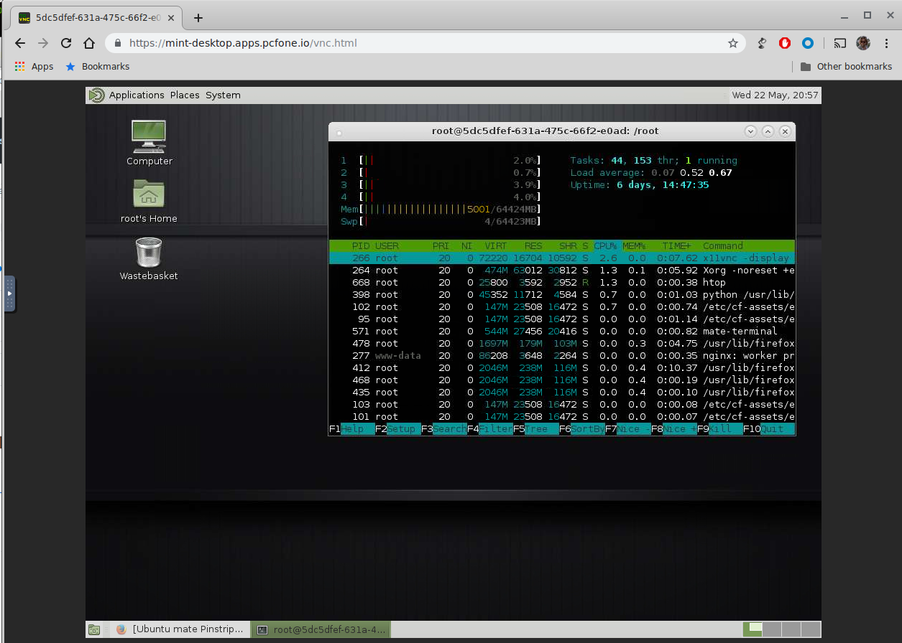

Run a linux Desktop Server on PCF

```console
  $ cf push -k 2g linux-desktop --docker-image pddenhar/docker-mint-vnc-desktop
```

If this is anything more than an quick demo, set a password for your instance.
```console
  $ cf set-env linux-desktop VNC_PASSWORD <password>
  $ cf restage linux-desktop
```

You can now access your desktop in a browser: https://linux-desktop.domain.com/vnc.html



