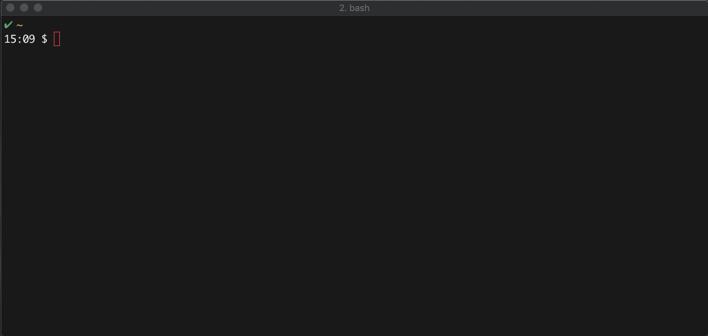

Run a starwars text movie server on PCF

```console
  $ cf push cf-starwars --docker-image jmcdice/cf-starwars -d tcp.apps.pcfone.io --random-route
```

Retrieve connection details (hostname/port) and connect to your server:

```console
  $ cf apps | grep starwars
    cf-starwars     started           1/1         1G       1G     tcp.apps.pcfone.io:10017

  $ nc tcp.apps.pcfone.io 10017
```

Run locally just using docker
```console
  $ docker run -itd --name starwars -p 801:8080 jmcdice/cf-starwars
  $ nc localhost 801
```



