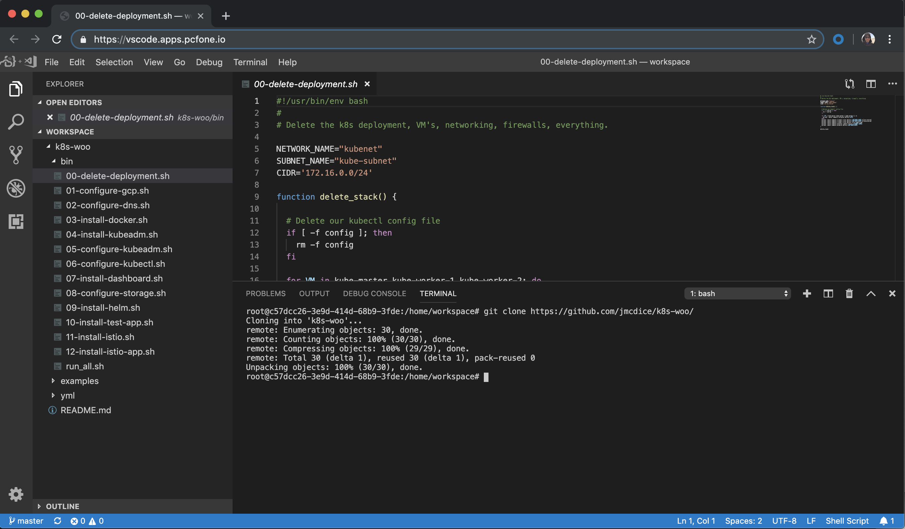

Run a VSCode IDE server

## Cloud Foundry Deployment
```console
  $ cf push vsc --docker-image jmcdice/vscode-server:latest --no-start
  $ cf set-env vsc PASSWD changeme
  $ cf start vsc
```

You can now access VSCode in a browser: https://vsc.domain.com/ using the password above.

## k8s Deployment
```console
  $ kubectl run --generator=run-pod/v1 --image=jmcdice/vscode-server:latest vscode
  $ kubectl expose pod vscode --type=NodePort --name=vscode --port=80 --target-port=8080

  # Note the service port from this command
  $ kubectl get svc vscode

  # Example FW rule for GCP
  $ gcloud compute firewall-rules create vscode --direction=INGRESS \
    --priority=1000 --network=default --action=ALLOW --rules=tcp:<NodePort>
```

Once in, do: Terminal -> New Terminal

```console
  $ git checkout https://github.com/your/repo/
```

You'll see your repo in the current workspace.



